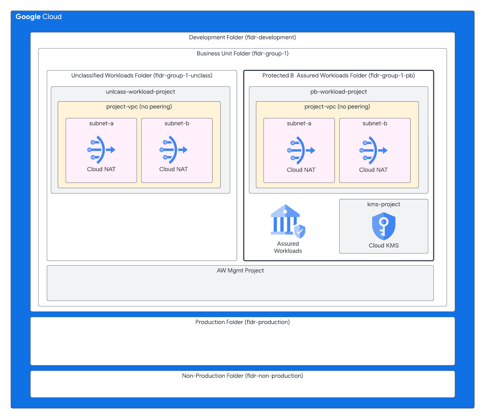

# Assured Workloads Projects

This repo is part of a multi-part guide that shows how to configure and deploy
the example.com reference architecture described in
[Google Cloud security foundations guide](https://cloud.google.com/architecture/security-foundations). The following table lists the parts of the guide.

This repo is used to create a Protected B Medium-Medium (PBMM) compliant Landing Zone on Google Cloud. 

The `4-assured-workloads-projects` folder proposes a simple project factory creating either a folder or a Data Boundary powered by Assured Workloads folder depending on the classification of the data and workload. 

## About Data Boundary powered by Assured Workloads

[Assured Workloads](https://cloud.google.com/assured-workloads) is a service that allows you to create and manage controlled environments that enforce specific compliance requirements for your Google Cloud workloads. For this PBMM Landing Zone, it is used to create a data boundary for workloads that handle Protected B data.

When you create an Assured Workloads environment for a compliance regime like `CA_PROTECTED_B`, Google Cloud ensures that the services and resources within that environment adhere to the controls required by that standard. This includes:

*   **Data Residency:** Enforces that customer data is stored and processed only within the specified geographic location (in this case, Canada).
*   **Personnel Access Controls:** Limits Google support and administrative access to personnel who meet the requirements for that compliance regime.
*   **Service Constraints:** Restricts the use of Google Cloud services to only those that are compliant with the specified regime.

In this project factory, an Assured Workloads environment is configured to create a special folder. Projects created through the factory are placed into either a standard "unclassified" folder or the Protected B Assured Workloads folder, based on their `data_classification` metadata. This ensures that any project intended to handle Protected B data automatically inherits the necessary security controls and compliance guardrails.

## Prerequisites

In the [0-bootstrap](../0-bootstrap/README.md) step, we added the `roles/assuredworkloads.admin` role to the bootstrap service account.  This role contains the minimum IAM permissions to create and manage Assured Workloads folders.

## Assigning groups

This project factory implements a Role-Based Access Control (RBAC) model by assigning IAM roles to dedicated Google Groups for administrators and editors. This approach centralizes user management within Google Workspace or Cloud Identity.

For each project created, the factory expects a set of groups to be defined in the `admin_group` and `editor_group` in the `projects.json` file. The factory then assigns a curated list of IAM roles to these groups on their respective projects. Group creation and membership can be used to create groups and assign membership.  This is defined in `groups.json`. 


*   **Admin Roles**: The roles assigned to the `admin_group` are defined in `modules/project-template/admin-roles.json`. These roles are intended for users who need broad permissions to manage project settings, resources, and IAM policies.

*   **Editor Roles**: The roles for the `editor_group` are defined in `modules/project-template/editor-roles.json`. These are tailored for developers and operators who need to create, modify, and delete resources within the project but do not need to manage project-level IAM or billing settings.

By managing roles in external JSON files, you can easily audit and update permissions for each group type across all projects created by this factory.


## Architecture

### Folder Structure

```
fldr-development
└── fldr-group-pb-1
    └──fldr-group-pb-1-pb-nnnn
       ├── project-1-pb
       ├── project-2-pb    
       └── group-1-kms
    └──fldr-group-pb-1-unclass
       └── project-3
    └── dep-development-group1
```

### Architecture Diagram




## Deployment

This step requires successful deployment for [0-bootstrap](../0-bootstrap/README.md), [1-org](../1-org/README.md), and [2-environments](../2-environments/README.md).

Follow the deployment instructions in [4-projects#run-terraform-locally](../4-projects/README.md#run-terraform-locally).


## Tips

We also strongly recommend that you do not nest an Assured Workloads folder within another Assured Workloads folder - even if they are the same compliance framework - as this will cause errors. You can, however, nest Assured Workloads folders and non-Assured Workloads folders with each other.

## Related Resources

-  [Assured Workloads Quick Start Guide](https://services.google.com/fh/files/misc/assured_workloads_quick_start_guide_0423.pdf)
-  [Data Boundary for Canada Protected B](https://docs.cloud.google.com/assured-workloads/docs/control-packages/canada-protected-b)
- [Google Cloud’s Protected B Compliance](https://cloud.google.com/security/compliance/protected-b)
-  [Personnel Data Access Controls](https://docs.cloud.google.com/assured-workloads/docs/personnel-access-data-controls)
-  [Control Data Access using Access Approval](https://docs.cloud.google.com/assured-workloads/docs/access-approval)
-  [VPC Service Controls](https://docs.cloud.google.com/vpc-service-controls/docs/overview)
-  [Best Practices for Enabling VPC Service Controls](https://docs.cloud.google.com/vpc-service-controls/docs/enable)